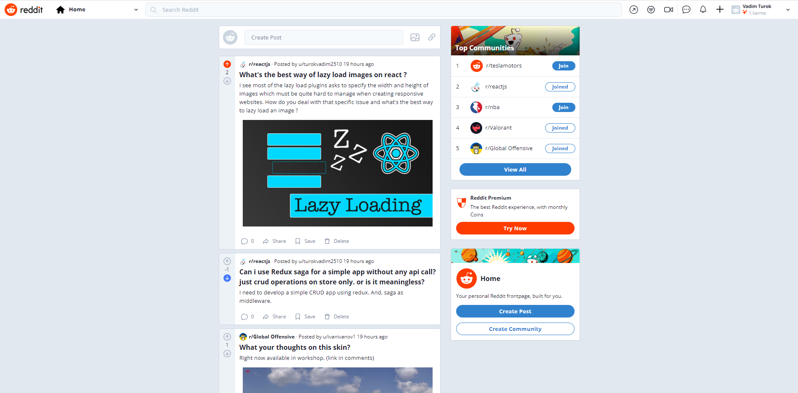

# 🖋️Reddit Clone
> Live demo
>  [_here_](https://reddit-clone-five-alpha.vercel.app/). <!-- If you have the project hosted somewhere, include the link here. -->

## Table of Contents
* [Technologies Used](#technologies-used)
* [Features](#features)
* [Screenshots](#screenshots)
* [Setup](#setup)
* [Project Status](#project-status)
* [Contact](#contact)
<!-- * [License](#license) -->


## Technologies Used
- NextJS
- React.js
- Recoil
- Chakra UI
- Firebase
- TypeScript
- Moment


## Features
Main features of the app:
- Joining & Leaving communities
- Createing communities
- Moderating communities
- Creating posts in selected community
- Deleting posts
- Upvoting & Downvoting
- Creating comments
- Deleteing comments
- Authorization system using email/password or Google auth


## Screenshots

<!-- If you have screenshots you'd like to share, include them here. -->


## Setup
Run application in development environment:

```
npm install
npm run dev
```


## Project Status
Project is: _completed_

Tutorial by author of the project on YT: https://www.youtube.com/watch?v=zhx9FUSuAsM


## Contact
Contact with me via e-mail: turokvadim2510@gmail.com


<!-- Optional -->
<!-- ## License -->
<!-- This project is open source and available under the [... License](). -->
